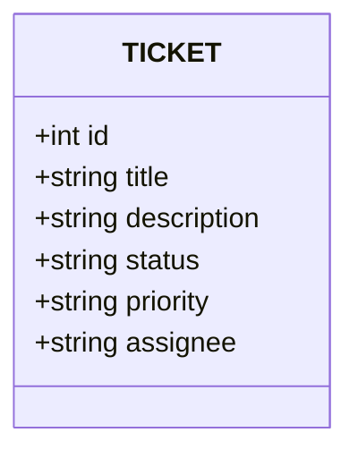

# 🎫 Ticket Tracker - Schnellstart

Einfacher Ticket-Tracker mit FastAPI, SQLite Datenbank und Web-Interface.

## 🛠 Git Flow

Das Projekt folgt einer standardisierten Branching-Strategie:

* **`main`**: Stabile Version (v1.0). Enthält den produktionsreifen Code.
* **`dev`**: Der zentrale Integrations-Branch. Alle neuen Features werden hier zuerst für Tests zusammengeführt.
* **`feature/*`**: Temporäre Branches für spezifische Aufgaben (z. B. `feature/user-auth`). Nach Abschluss werden sie in den `dev`-Branch gemergt.

## 🚀 Projekt starten

### 1. Abhängigkeiten installieren

```bash
# Virtuelles Environment erstellen (mit nativem Python 3.13 für M4)
python3 -m venv .venv

# Virtuelles Environment aktivieren (falls verwendet)
source .venv/bin/activate

# Notwendige Pakete installieren
pip install fastapi "uvicorn[standard]" sqlalchemy "passlib[bcrypt]" python-multipart requests
```

### 2. Server starten

```bash
uvicorn fast_api:app --reload --host 127.0.0.1 --port 8001
```

Server läuft auf: `http://127.0.0.1:8001`

## 📋 Verfügbare Interfaces

Nach dem Serverstart haben Sie 3 Möglichkeiten mit der API zu arbeiten:

### 🔧 1. Swagger UI (API Dokumentation)

**Link:** http://127.0.0.1:8001/docs

✅ Was Sie tun können:
- Alle API Endpoints testen
- Tickets erstellen, lesen, aktualisieren und löschen
- Datenschemata anzeigen
- Automatische Dokumentation erhalten

### 🌐 2. Web-Interface (HTML Dashboard)

**Link:** http://127.0.0.1:8001/ui/index.html

✅ Was Sie tun können:
- Schönes Web-Interface zur Ticket-Verwaltung
- Tickets über Formulare erstellen und bearbeiten
- Liste aller Tickets in Tabellenform anzeigen
- Daten filtern und sortieren

### 💻 3. Python Client (Automatische Tests)

```bash
python3 client.py
```

✅ Was passiert:
- Erstellt automatisch mehrere Test-Tickets
- Demonstriert alle CRUD-Operationen
- Zeigt Fehlerbehandlung
- Gibt schön formatierte JSON-Antworten aus

## 📊 Ticket-Datenstruktur

```json
{
  "id": 1,
  "title": "Login-Bug beheben",
  "description": "Benutzer kann sich nicht mit korrektem Passwort anmelden",
  "status": "open",
  "priority": "high",
  "assignee": "Dima"
}
```

**Status-Optionen:** `open` | `in_progress` | `done`

**Priority-Optionen:** `low` | `normal` | `high`

## 🛠️ Haupt-API Befehle

| Methode | Endpoint | Beschreibung |
|---------|----------|--------------|
| `POST` | `/tickets` | Neues Ticket erstellen |
| `GET` | `/tickets` | Alle Tickets abrufen |
| `GET` | `/tickets/{id}` | Ticket nach ID abrufen |
| `PUT` | `/tickets/{id}` | Ticket aktualisieren |
| `DELETE` | `/tickets/{id}` | Ticket löschen |
| `DELETE` | `/tickets` | 🚨 ALLE Tickets löschen |

## 💾 Datenbank

- **Typ:** SQLite (Datei `tickets.db`)
- **Speicherort:** Im gleichen Ordner wie `fast_api.py`
- **Persistenz:** Daten bleiben zwischen Server-Neustarts erhalten

## 📁 Projektstruktur

```
ticket-tracker/
├── fast_api.py      # 🖥️ Backend Server mit FastAPI
├── client.py        # 🧪 Test Client
├── index.html       # 🌐 Web-Interface
├── tickets.db       # 💾 SQLite Datenbank
├── README.md        # 📖 Diese Datei
└── spec.md          # 📋 Detaillierte Spezifikation
```



## 🎯 Schnelltest

1. Server starten:

```bash
uvicorn fast_api:app --reload --host 127.0.0.1 --port 8001
```

2. Web-Interface öffnen: http://127.0.0.1:8001/ui/index.html

3. Test-Ticket über Formular oder Swagger erstellen

4. Automatische Tests starten:

```bash
python3 client.py
```

## ⚡ Nützliche Links

- **Swagger UI:** http://127.0.0.1:8001/docs
- **ReDoc:** http://127.0.0.1:8001/redoc
- **Web-Interface:** http://127.0.0.1:8001/ui/index.html
- **OpenAPI JSON:** http://127.0.0.1:8001/openapi.json

## 🔧 Server stoppen

Drücken Sie `Ctrl+C` im Terminal wo uvicorn läuft.

---

🎉 **Fertig! Ihr Ticket-Tracker ist einsatzbereit!**

# 🚀 Roadmap: Auth, Roles & Pro Features

Dieser Plan umfasst die nächsten Schritte zur Verbesserung der Architektur, Implementierung der rollenbasierten Zugriffskontrolle (RBAC) und Datensicherheit.


## 🛠 Etappe 1: Architektur & Datenbank (Core)
*Logik korrigieren und Tabellen vorbereiten.*

- [x] **Automatische ID:** In `fast_api.py` die `id` in `TicketDB` auf `autoincrement=True` setzen.
- [x] **Benutzertabelle:** Modell `UserDB` erstellen (id, username, password_hash, role).
- [x] **Ticket-Verknüpfung:** Feld `owner_id` (ForeignKey zu User) in `TicketDB` hinzufügen.
- [x] **Pydantic-Schemas:** Modelle aufteilen in `TicketCreate` (ohne ID) und `Ticket` (mit ID).

---

## 🔐 Etappe 2: Autorisierung & Sicherheit (Security)
*Implementierung des Login-Systems.*

- [ ] **Passwort-Hashing:** `passlib` (bcrypt) integrieren, um Passwörter sicher zu speichern.
- [ ] **JWT Tokens:** Endpoint `/token` für die Ausgabe von OAuth2-Token implementieren.
- [ ] **Endpunktschutz:** `Depends(get_current_user)` für alle CRUD-Operationen hinzufügen.
- [ ] **Rollenmodell (User vs. Admin):**
    - `User`: Kann nur **eigene** Tickets bearbeiten/schließen.
    - `Admin`: Zugriff auf `Danger Zone` (alles löschen) und Bearbeitung aller Tickets.

---

## 📊 Etappe 3: Funktionen & Filter (Pro Features)
*Effiziente Datenverwaltung.*

- [ ] **Intelligente Suche:** Query-Parameter für `GET /tickets` hinzufügen (Filter nach Status, Priorität).
- [ ] **Audit Log (Historie):** Tabelle `ticket_events` erstellen.
    - Speichern von: "Wer", "Wann", "Welches Feld geändert wurde" (z. B. Status: open -> closed).
- [ ] **Middleware:** Logging aller API-Anfragen in der Konsole oder Datei implementieren.

---

## 🎨 Etappe 4: Benutzeroberfläche (Frontend)
*Änderungen im Browser widerspiegeln.*

- [ ] **Login-Seite:** Einfaches Login/Register-Formular in `index.html` hinzufügen.
- [ ] **Session-Management:** Speichern des JWT-Tokens im `localStorage`.
- [ ] **Intelligente UI:** - "Alle löschen"-Button für normale User ausblenden.
    - Benutzernamen des angemeldeten Users im Header anzeigen.

---

## 📋 Berechtigungsmatrix (RBAC)
| Aktion | User (Standard) | Admin |
| :--- | :--- | :--- |
| Alle Tickets anzeigen | ✅ Ja | ✅ Ja |
| Ticket erstellen | ✅ Ja | ✅ Ja |
| Eigenes Ticket bearbeiten | ✅ Ja | ✅ Ja |
| FREMDES Ticket bearbeiten | ❌ Nein | ✅ Ja |
| EINZELNES Ticket löschen | ⚠️ Nur eigenes | ✅ Beliebig |
| Danger Zone (Alles löschen) | ❌ Nein | ✅ Ja |