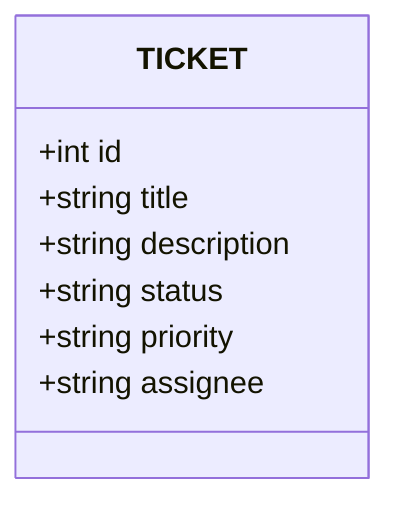

# 🎫 Ticket Tracker - Schnellstart

Einfacher Ticket-Tracker mit FastAPI, SQLite Datenbank und Web-Interface.

## 🚀 Projekt starten

### 1. Abhängigkeiten installieren

```bash
# Virtuelles Environment erstellen (mit nativem Python 3.13 für M4)
python3 -m venv .venv

# Virtuelles Environment aktivieren (falls verwendet)
source .venv/bin/activate

# Notwendige Pakete installieren
pip install fastapi "uvicorn[standard]" sqlalchemy "passlib[bcrypt]" python-multipart requests
```

### 2. Server starten

```bash
uvicorn fast_api:app --reload --host 127.0.0.1 --port 8001
```

Server läuft auf: `http://127.0.0.1:8001`

## 📋 Verfügbare Interfaces

Nach dem Serverstart haben Sie 3 Möglichkeiten mit der API zu arbeiten:

### 🔧 1. Swagger UI (API Dokumentation)

**Link:** http://127.0.0.1:8001/docs

✅ Was Sie tun können:
- Alle API Endpoints testen
- Tickets erstellen, lesen, aktualisieren und löschen
- Datenschemata anzeigen
- Automatische Dokumentation erhalten

### 🌐 2. Web-Interface (HTML Dashboard)

**Link:** http://127.0.0.1:8001/ui/index.html

✅ Was Sie tun können:
- Schönes Web-Interface zur Ticket-Verwaltung
- Tickets über Formulare erstellen und bearbeiten
- Liste aller Tickets in Tabellenform anzeigen
- Daten filtern und sortieren

### 💻 3. Python Client (Automatische Tests)

```bash
python3 client.py
```

✅ Was passiert:
- Erstellt automatisch mehrere Test-Tickets
- Demonstriert alle CRUD-Operationen
- Zeigt Fehlerbehandlung
- Gibt schön formatierte JSON-Antworten aus

## 📊 Ticket-Datenstruktur

```json
{
  "id": 1,
  "title": "Login-Bug beheben",
  "description": "Benutzer kann sich nicht mit korrektem Passwort anmelden",
  "status": "open",
  "priority": "high",
  "assignee": "Dima"
}
```

**Status-Optionen:** `open` | `in_progress` | `done`

**Priority-Optionen:** `low` | `normal` | `high`

## 🛠️ Haupt-API Befehle

| Methode | Endpoint | Beschreibung |
|---------|----------|--------------|
| `POST` | `/tickets` | Neues Ticket erstellen |
| `GET` | `/tickets` | Alle Tickets abrufen |
| `GET` | `/tickets/{id}` | Ticket nach ID abrufen |
| `PUT` | `/tickets/{id}` | Ticket aktualisieren |
| `DELETE` | `/tickets/{id}` | Ticket löschen |
| `DELETE` | `/tickets` | 🚨 ALLE Tickets löschen |

## 💾 Datenbank

- **Typ:** SQLite (Datei `tickets.db`)
- **Speicherort:** Im gleichen Ordner wie `fast_api.py`
- **Persistenz:** Daten bleiben zwischen Server-Neustarts erhalten

## 📁 Projektstruktur

```
ticket-tracker/
├── fast_api.py      # 🖥️ Backend Server mit FastAPI
├── client.py        # 🧪 Test Client
├── index.html       # 🌐 Web-Interface
├── tickets.db       # 💾 SQLite Datenbank
├── README.md        # 📖 Diese Datei
└── spec.md          # 📋 Detaillierte Spezifikation
```



## 🎯 Schnelltest

1. Server starten:

```bash
uvicorn fast_api:app --reload --host 127.0.0.1 --port 8001
```

2. Web-Interface öffnen: http://127.0.0.1:8001/ui/index.html

3. Test-Ticket über Formular oder Swagger erstellen

4. Automatische Tests starten:

```bash
python3 client.py
```

## ⚡ Nützliche Links

- **Swagger UI:** http://127.0.0.1:8001/docs
- **ReDoc:** http://127.0.0.1:8001/redoc
- **Web-Interface:** http://127.0.0.1:8001/ui/index.html
- **OpenAPI JSON:** http://127.0.0.1:8001/openapi.json

## 🔧 Server stoppen

Drücken Sie `Ctrl+C` im Terminal wo uvicorn läuft.

---

🎉 **Fertig! Ihr Ticket-Tracker ist einsatzbereit!**